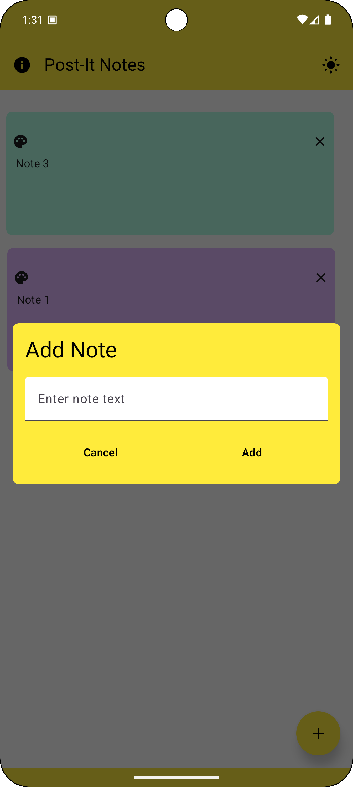
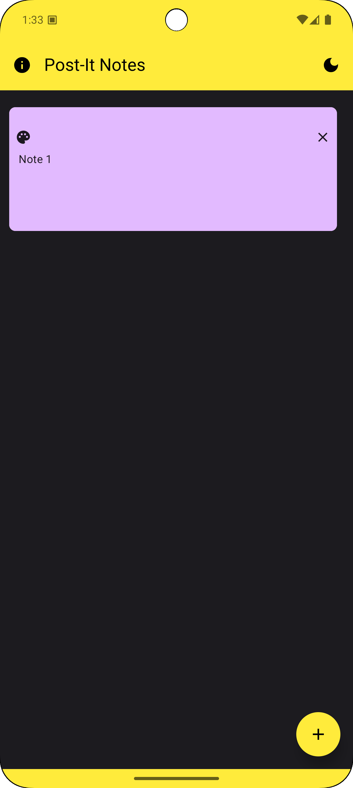
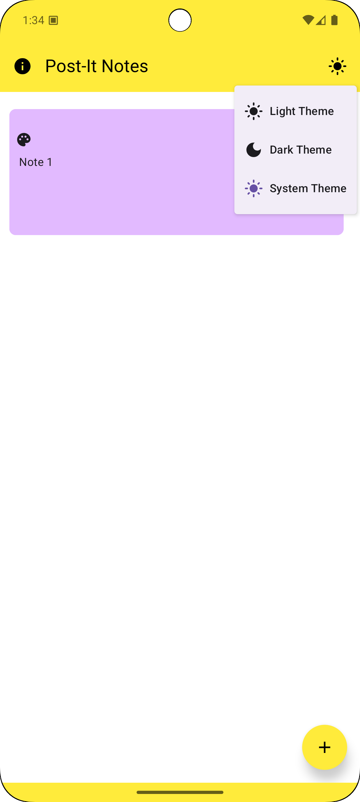
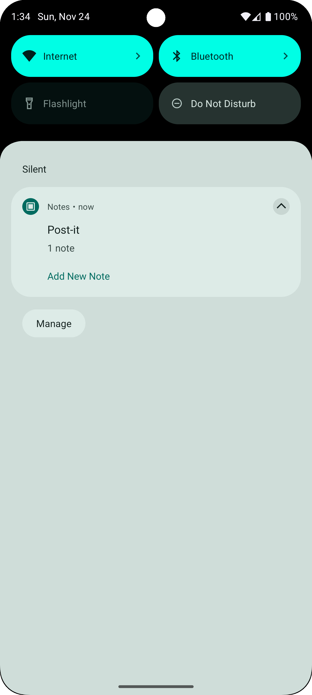
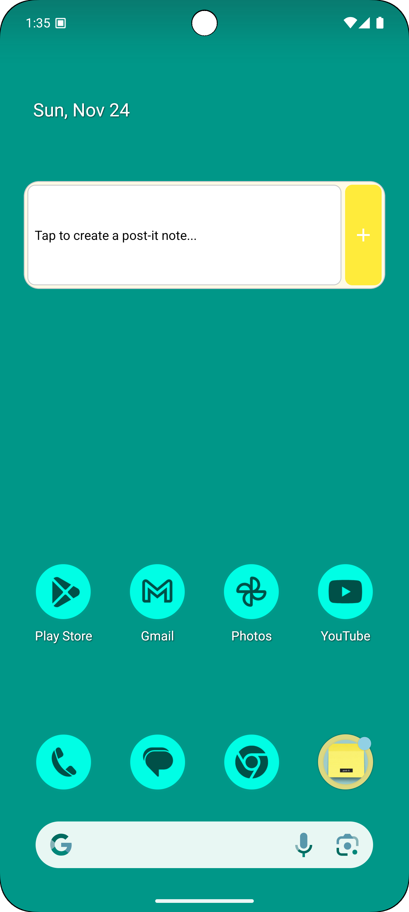
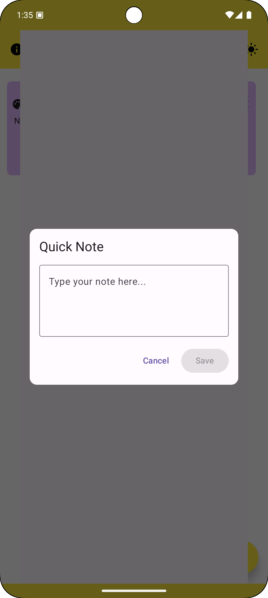
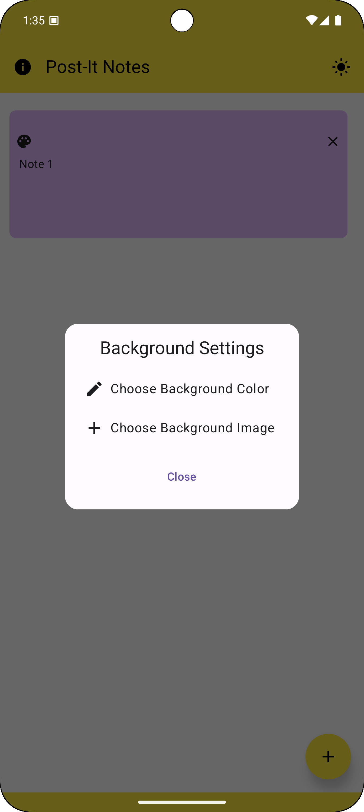
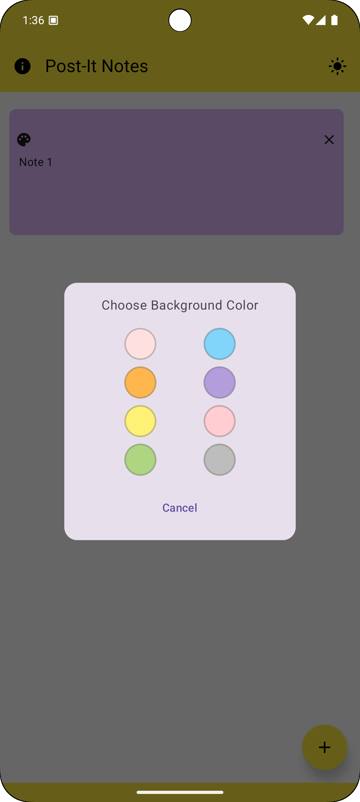
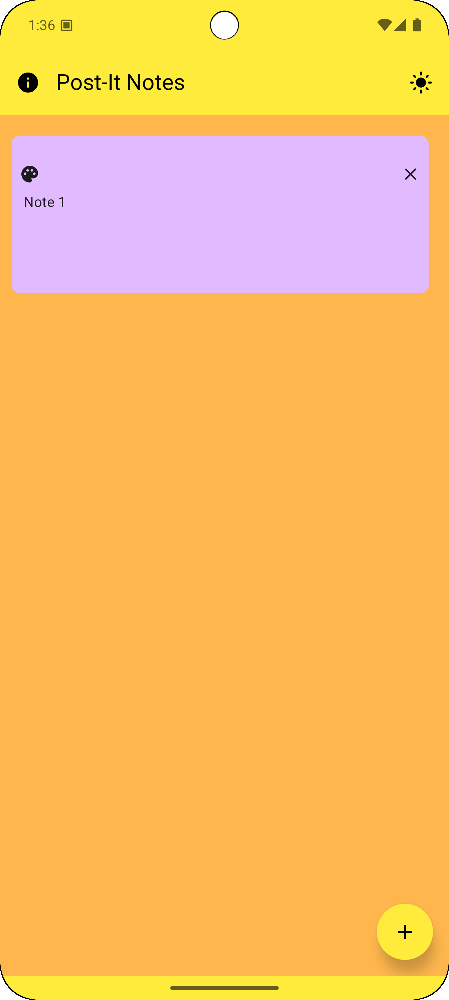

# Post-it Notes App

A modern Android notes app that mimics the experience of physical sticky notes with added digital convenience.

## Features

### Note Management
- Create and manage digital sticky notes
- Notes automatically resize based on content length
- Drag and drop notes anywhere on the screen
- Quick note creation from notification
- Delete notes with a single tap

### Rich Customization
- Customize note colors individually
- Change app background color or set custom background image
- Long press anywhere to access background settings
- Yellow-themed interface with dark icons for better visibility

### Smart UI
- Adaptive note sizes:
  - Regular notes: 200x150dp
  - Medium content (>50 chars): 250x200dp
  - Large content (>100 chars): 300x250dp
  - Extra large content (>200 chars): 350x300dp
- Separate drag handle area for better touch control
- Smooth animations when editing or moving notes
- Clear text visibility without needing to interact
- Consistent yellow theme with dark icons in both light and dark modes
- Yellow system bars (status and navigation) for a cohesive look

### User Interface
- Clean, minimalist top bar with essential controls
- About dialog with app information
- Dark mode support with theme-aware components
- Background customization available in light mode

### Persistent Notification
- Always-accessible quick note creation
- Shows current number of notes in app
- "Post-it" branding in notification
- Quick access to app via notification

## Technical Details

### Built With
- Kotlin
- Jetpack Compose for modern UI
- Material Design 3
- ViewModel architecture
- Room Database for persistence
- Kotlin Coroutines for async operations

### Requirements
- Android 6.0 (API level 23) or higher
- Notification permission for quick note creation

## Installation
1. Clone the repository
2. Open in Android Studio
3. Build and run on your device or emulator

## Usage
1. Launch app - a persistent notification will appear for quick access
2. Tap floating action button or use notification to create new notes
3. Drag notes by their header to reposition
4. Tap note to edit content
5. Use color picker to customize note colors
6. Long press background to change app background
7. Notes persist between app launches

## Permissions
- Notification permission: Required for quick note creation feature
- Storage permission: Optional, needed only for custom background images

## Contributing
Feel free to submit issues, fork the repository, and create pull requests for any improvements.

## License
This project is licensed under the MIT License - see the LICENSE file for details.

## Screenshots

*Main app interface with notes*

*Creating and editing notes*

*Note color customization*

*Background customization dialog*

*App with custom background*

*Dark mode interface*

*Quick note creation from notification*

*Managing multiple notes*

*Additional settings and options*

## Contact
Project Link: [https://github.com/jphermans/Notes](https://github.com/jphermans/Notes)

## Acknowledgments
* [Android Developer Documentation](https://developer.android.com/)
* [Material Design](https://material.io/)
